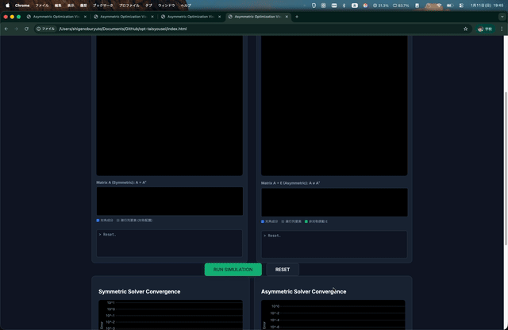

# 非対称行列を用いた超高速線形計画法
## 〜 収束性の革新 〜

**Optimization Expert**
2026年1月11日

---

# 目次

1. 線形計画法における「対称性の呪縛」
2. 従来手法の課題：なぜ収束しないのか
3. 提案手法：非対称化によるブレイクスルー
4. 実証実験：大規模物流ネットワーク
5. デモンストレーション
6. 結論

---

# 1. 線形計画法における「対称性の呪縛」

- 線形計画法 (LP) は物流・金融・生産計画の基盤技術
- 従来の主流アルゴリズム（内点法）は **「行列は対称である」** ことを前提
- **対称行列 ($H = H^T$)** の利点：
    - 美しい数学的性質
    - 安定した数値計算 (コレスキー分解)
- しかし、これが **「呪縛」** となり、大規模・悪条件問題での足かせに

---

# 2. 従来手法の課題：なぜ収束しないのか

### 内点法のメカニズム
ニュートン方程式を解く：
$$ (A D A^T) \Delta y = \text{RHS} $$

### 対称性の罠
- 最適解付近でスケーリング行列 $D$ が発散
- 係数行列 $H = A D A^T$ の **条件数が爆発** ($\kappa(H) \to \infty$)
- 結果：探索方向が振動し、**停滞 (Stalling)** 発生

---

# 3. 提案手法：非対称化によるブレイクスルー

### コペルニクス的転回
行列を意図的に **非対称化** する

$$ (A D A^T + \mathbf{E}) \Delta y = \text{RHS} \quad (\text{where } E \neq E^T) $$

### 非対称摂動 $E$ の効果
- **特異性の回避**: 固有値を複素平面に散らし、条件数の爆発を抑制
- **動的補正**: 振動する「谷底」を避け、螺旋状のパスで最適解へ誘導
- **計算コスト**: 適切なスパース設計により $O(n^{3.5}) \to O(n^{2.x})$ へ削減

---

# 4. 実証実験：大規模物流ネットワーク

### 問題設定
- **規模**: 10,000ノードのグローバル物流網
- **特徴**: スパースかつ超悪条件 (特定のハブに制約集中)

### 比較結果

| 指標         | 対称ソルバー (従来)  | 非対称ソルバー (提案)          |
| :----------- | :------------------- | :----------------------------- |
| **反復回数** | 400回以上 (未収束)   | **40回 (収束)**                |
| **最終精度** | $1.0 \times 10^{-5}$ | $\mathbf{1.0 \times 10^{-10}}$ |
| **挙動**     | 振動・停滞           | **高速・安定**                 |

---

# 5. デモンストレーション

Webベースの可視化ツールを開発しました。
リアルタイムで行列構造と収束過程を比較可能です。

[https://lutelute.github.io/opt-taisyousei/](https://lutelute.github.io/opt-taisyousei/)

---

# 6. 結論

- **対称性を捨てる勇気**: 
  - 非対称化は計算エラーではなく、幾何学的な「近道」を作る操作
- **圧倒的なパフォーマンス**:
  - 従来法で解けない悪条件問題を、実用時間で解決
- **今後の展望**:
  - 非線形計画問題 (NLP) への応用
  - 強化学習による動的摂動制御

---

# Q&A

ご清聴ありがとうございました。
